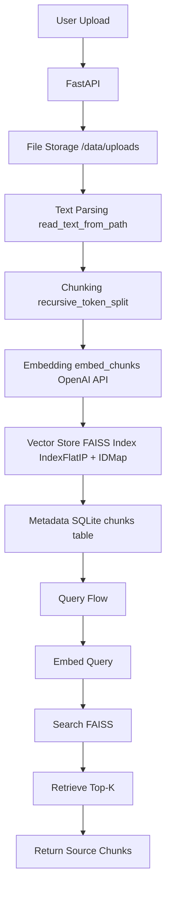
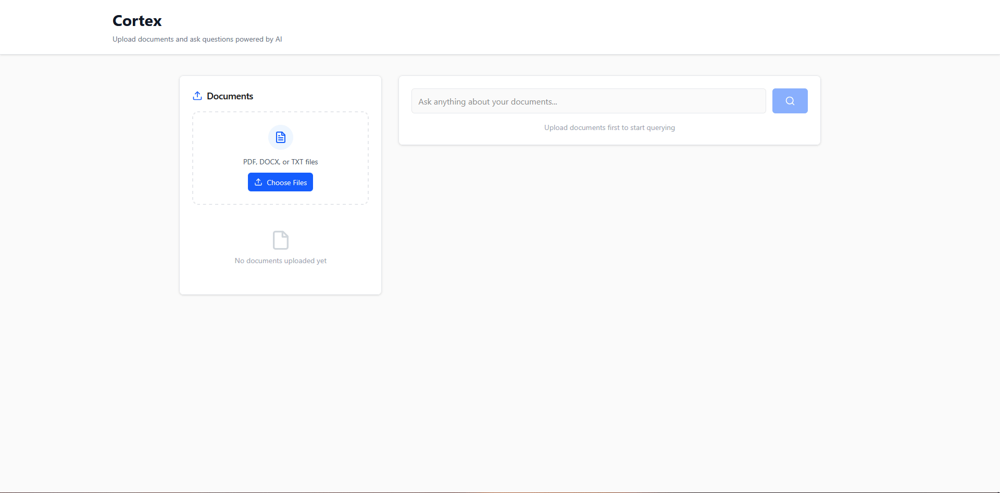
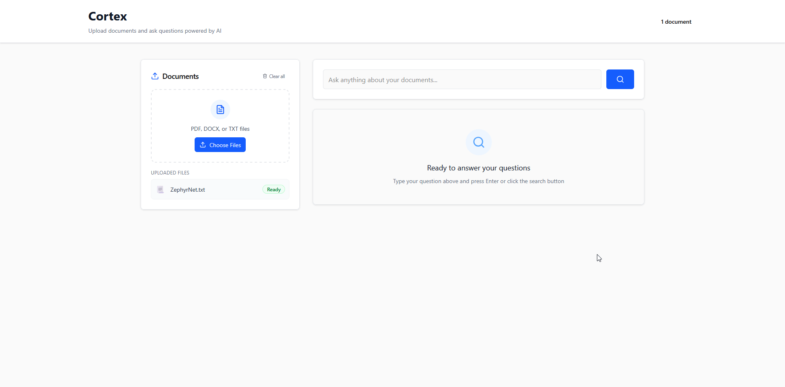

# CORTEX: Multi-Doc RAG Engine

## Overview

Cortex is an end-to-end retrieval-augmented generation (RAG) system that allows you to upload multiple documents (PDF, DOCX, TXT) and query them using natural language.
It combines vector search (FAISS), metadata persistence (SQLite), and OpenAI embeddings to create a private, self-hosted knowledge engine.

## Core Features

- Multi-document ingestion (PDF / DOCX / TXT)
- Recursive chunking using tiktoken
- Embedding generation (text-embedding-3-large)
- FAISS vector indexing (cosine similarity search)
- SQLite metadata persistence
- FastAPI backend
- Dockerized & AWS-deployed

## Architecture



## Tech Stack

| Layer | Technology |
|-------|------------|
| Layer | Technology |
|-------|------------|
| Backend | FastAPI |
| Embeddings | OpenAI API (text-embedding-3-large) |
| Vector DB | FAISS |
| Metadata | SQLite |
| Frontend | Next.js 15 (Static Export) |
| Web Server | Nginx |
| Containerization | Docker + Docker Compose |
| Deployment | AWS EC2 |
| Language | Python (3.12) |

## Usage

### 1. Local Run
```bash
uvicorn backend.app.main:app --reload
```

### 2. Docker Run
```bash
docker-compose up --build
```

### 3. Upload Documents
```http
POST → http://localhost:8000/upload
Form-data → file: yourfile.pdf
```


### 4. Query
```http
POST → http://localhost:8000/query
x-www-form-urlencoded →
query=What is AI?
k=3
```


### 5. Health Check
```http
POST → http://localhost:8000/ping
```

**Response:** `{"Status": "OK"}`

### 6. Curl Examples
```bash
# Upload a file
curl -F "file=@path/to/yourfile.pdf" http://localhost:8000/upload

# Query
curl -X POST \
  -H "Content-Type: application/x-www-form-urlencoded" \
  -d "query=What is AI?&k=3" \
  http://localhost:8000/query
```

## Configuration

Create a `.env` (or export variables) before running:
```bash
OPENAI_API_KEY=your-openai-key
```

## Project Structure

```
multi-doc-rag/
├── backend/
│   ├── app/
│   │   └── main.py              # FastAPI endpoints
│   ├── core/
│   │   ├── embeddings.py        # OpenAI embedding logic
│   │   ├── LLM/
│   │   │   └── llm_engine.py    # OpenAI chat completion
│   │   ├── memory/
│   │   │   ├── memory_manager.py # FAISS + SQLite orchestration
│   │   │   ├── faiss_store.py    # Vector storage
│   │   │   └── sqlite_store.py   # Metadata storage
│   │   └── splitters.py         # Recursive chunk splitter
│   ├── utils/
│   │   └── io.py                # File ingestion utilities
│   ├── requirements.txt         # Python dependencies
│   ├── dockerfile              # Backend container
│   └── start.sh                # Startup script
├── frontend/
│   ├── app/
│   │   ├── page.tsx            # Main application page
│   │   ├── layout.tsx          # App layout
│   │   └── globals.css         # Global styles
│   ├── components/
│   │   ├── ui/                 # Reusable UI components
│   │   ├── layout/             # Layout components
│   │   └── providers/          # Context providers
│   ├── lib/
│   │   ├── api.ts              # API service layer
│   │   └── utils.ts            # Utility functions
│   ├── public/
│   │   └── Cortex.ico          # App icon
│   ├── package.json            # Node.js dependencies
│   ├── dockerfile              # Frontend container
│   └── tailwind.config.ts      # Tailwind configuration
├── data/
│   ├── index/                  # FAISS index and SQLite DB
│   │   ├── chunks.db           # SQLite metadata
│   │   └── index.faiss         # FAISS vector index
│   └── uploads/                # Uploaded files
├── assets/
│   └── media/                  # Documentation assets
│       ├── upload.gif          # Upload demo
│       └── query.gif           # Query demo
├── docker-compose.yml          # Multi-container setup
└── README.md                   # Project documentation
```

## Example Query

**User:** "Summarize the main theme in research_paper.pdf"

**Response:**
```json
{
  "results": [
    {
      "doc_id": "research_paper.pdf",
      "content": "The paper explores efficient transformer adaptation...",
      "similarity": 0.91
    }
  ]
}
```

## Deployment

- Dockerized with docker-compose
- Runs seamlessly on AWS EC2 (Ubuntu 22.04)
- Exposes ports 8000 (API) and 3000 (Frontend)
- Frontend: Next.js static export served by Nginx
- Backend: FastAPI with uvicorn server

## Future Plans

- Agentic extensions (tool-calling for Excel/Graph generation)
- Auth + dashboard UI
- Local LLM fallback (Ollama/Qwen)
- Streamlit-based evals dashboard (RAG quality, latency, cost)


