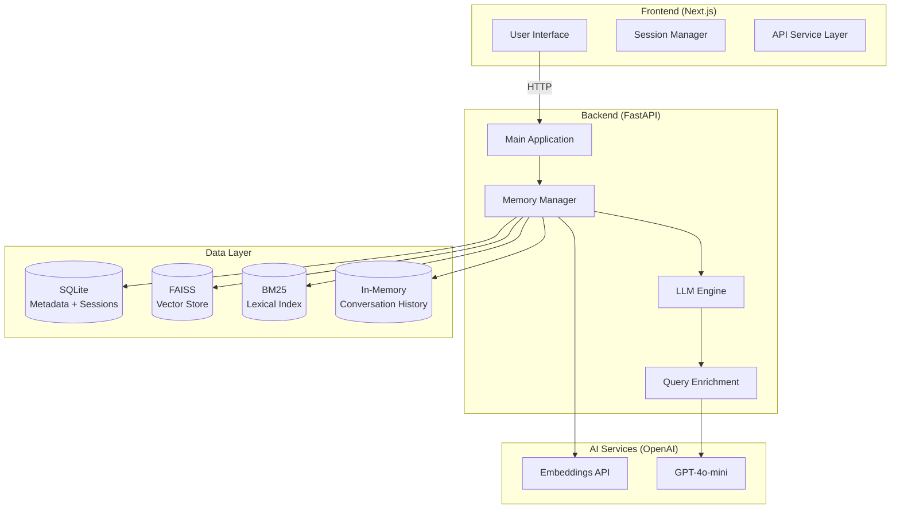
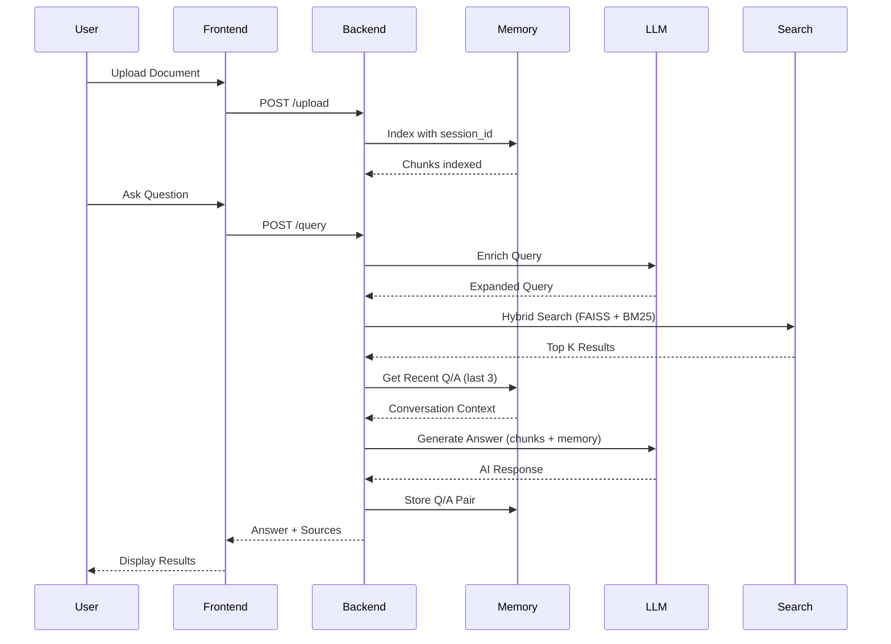

# Cortex - Advanced Multi-Document RAG System

A production-ready Retrieval Augmented Generation (RAG) system with **contextual memory** and **hybrid search** capabilities. Upload documents, ask questions, and have intelligent conversations with your data using AI-powered search. Built with FastAPI, Next.js, and OpenAI's latest models.


## Key Features

### Intelligent Memory System
- **Contextual Memory**: Remembers previous Q/A pairs in the same session
- **Follow-up Understanding**: "Tell me more about that" actually works!
- **Session Isolation**: Each user gets their own memory bubble
- **Memory Limits**: Only keeps last 3 conversations (clean & efficient)
- **Ephemeral Design**: Memory dies with session (perfect for Cortex's philosophy)

### Hybrid Search Engine
- **Semantic Search**: FAISS vector similarity search with OpenAI embeddings
- **Lexical Search**: BM25 exact term matching for precise results
- **Reciprocal Rank Fusion**: Intelligently combines both search types
- **Query Enrichment**: LLM expands queries for better recall
- **Smart Preprocessing**: spaCy-based text normalization

### Confidence Scoring
- **Overall Confidence**: High/Medium/Low confidence badges
- **Individual Source Scores**: Color-coded match percentages (60-95% range)
- **Visual Indicators**: Green/Yellow/Red based on relevance
- **Confidence Explanation**: Shows reasoning behind scores
- **Realistic Scoring**: Smart confidence calculation

### Document Management
- **Multi-Format Support**: Upload PDF, DOCX, and TXT files
- **Intelligent Chunking**: Token-based text splitting with overlap for better context
- **Metadata Storage**: SQLite for chunk metadata with session isolation
- **Automatic Cleanup**: Ready for cron job data cleanup

### AI Integration
- **OpenAI GPT-4o-mini**: For answer generation
- **Query Expansion**: LLM improves search queries
- **Context-Aware Responses**: Uses retrieved chunks + memory
- **Source Attribution**: Shows which documents were used
- **Memory-Enhanced Answers**: Includes conversation context

### Modern UI
- **Responsive Design**: Works on desktop and mobile
- **Real-time Feedback**: Loading states and progress indicators
- **Confidence Visualization**: Color-coded confidence indicators
- **Source Management**: Shows document names and match scores
- **Clean Interface**: Intuitive and user-friendly

## Architecture

### System Overview



### How Cortex Works



## Tech Stack

### Backend
- **FastAPI** - Modern Python web framework
- **FAISS** - Facebook AI Similarity Search for vector operations
- **BM25** - Lexical search with rank_bm25
- **SQLite** - Lightweight database for metadata + session storage
- **OpenAI API** - Text embeddings and language generation
- **spaCy** - Text preprocessing and normalization
- **PyPDF2** - PDF text extraction
- **python-docx** - DOCX file processing
- **Tiktoken** - Token counting and text chunking

### Frontend
- **Next.js 15** - React framework with App Router
- **TypeScript** - Type-safe JavaScript
- **Tailwind CSS** - Utility-first CSS framework
- **Lucide React** - Beautiful icons
- **Custom Components** - Reusable UI components

### Infrastructure
- **Docker** - Containerization
- **Docker Compose** - Multi-container orchestration
- **Nginx** - Frontend serving (production)

## Quick Start

### Prerequisites
- Docker and Docker Compose
- OpenAI API key

### 1. Clone the Repository
```bash
git clone https://github.com/The-Digital-Alchemist/multi-doc-rag.git
cd multi-doc-rag
```

### 2. Set Environment Variables
```bash
export OPENAI_API_KEY="your-openai-api-key-here"
```

### 3. Start the Application
```bash
docker-compose up --build
```

### 4. Access the Application
- **Frontend**: http://localhost:3000
- **Backend API**: http://localhost:8000
- **API Documentation**: http://localhost:8000/docs

## Usage

### Upload Documents
1. Navigate to the upload section
2. Click "Choose Files" or drag and drop files
3. Supported formats: PDF, DOCX, TXT
4. Files are automatically processed and indexed with session isolation

### Query Documents
1. Enter your question in the search box
2. Click the search button or press Enter
3. View AI-generated answers with source attribution
4. Review similarity scores and confidence levels for each source
5. **Ask follow-up questions** - Cortex remembers the conversation!

### Memory Features
- **Contextual Conversations**: Ask "Tell me more about that" and Cortex understands
- **Session Isolation**: Each browser session has its own memory
- **Memory Limits**: Only keeps last 3 conversations (clean & efficient)
- **Clear Session**: Reset memory and start fresh anytime

## API Endpoints

### Upload Document
```http
POST /upload
Content-Type: multipart/form-data

file: [binary file data]
session_id: "your-session-id"
```

### Query Documents
```http
POST /query
Content-Type: application/x-www-form-urlencoded

query: "Your question here"
k: 3
session_id: "your-session-id"
```

### Health Check
```http
POST /ping
```

**Note**: All endpoints now support session-based isolation for memory and document management.

## Project Structure

```
cortex-rag/
├── backend/
│   ├── app/
│   │   └── main.py              # FastAPI application
│   ├── core/
│   │   ├── embeddings.py        # OpenAI embedding service
│   │   ├── splitters.py         # Text chunking logic
│   │   ├── LLM/
│   │   │   └── llm_engine.py    # OpenAI chat completion + query enrichment
│   │   └── memory/
│   │       ├── memory_manager.py # Main RAG orchestrator
│   │       ├── faiss_store.py    # Vector storage
│   │       ├── sqlite_store.py   # Metadata storage
│   │       ├── lexical_store.py  # BM25 lexical search
│   │       └── conversation_memory.py # Session-based memory
│   ├── utils/
│   │   ├── io.py                # File I/O utilities
│   │   └── preprocessor.py      # Text preprocessor for BM25
│   ├── requirements.txt         # Python dependencies
│   └── dockerfile              # Backend container
├── frontend/
│   ├── app/
│   │   ├── page.tsx            # Main application page
│   │   └── layout.tsx          # App layout
│   ├── components/
│   │   └── ui/                 # Reusable UI components
│   ├── lib/
│   │   ├── api.ts              # API service layer
│   │   └── session.ts          # Session management
│   ├── package.json            # Node.js dependencies
│   └── dockerfile              # Frontend container
├── data/                       # Persistent data storage
│   ├── index/                  # FAISS index and SQLite DB
│   └── uploads/                # Uploaded files
└── docker-compose.yml          # Multi-container setup
```

## Key Features Deep Dive

### Contextual Memory System
- **Session-based isolation**: Each user gets their own memory bubble
- **Q/A pair storage**: Stores original queries and responses
- **Memory limits**: Only keeps last 3 conversations (FIFO)
- **Context awareness**: Enables follow-up questions like "Tell me more about that"
- **Ephemeral design**: Memory dies with session (perfect for Cortex's philosophy)

### Hybrid Search Engine
- **Semantic Search**: FAISS vector similarity with OpenAI embeddings
- **Lexical Search**: BM25 exact term matching for precise results
- **Reciprocal Rank Fusion**: Intelligently combines both search types
- **Query Enrichment**: LLM expands queries for better recall
- **Smart Preprocessing**: spaCy-based text normalization

### Confidence Scoring
- **Overall Confidence**: High/Medium/Low confidence badges
- **Individual Source Scores**: Color-coded match percentages (60-95% range)
- **Visual Indicators**: Green/Yellow/Red based on relevance
- **Confidence Explanation**: Shows reasoning behind scores

### Document Processing
- **Multi-format support**: PDF, DOCX, TXT files
- **Intelligent chunking**: Tiktoken-based token counting (400 tokens with 100 overlap)
- **Session isolation**: All documents tagged with session_id
- **Metadata storage**: SQLite for chunk metadata with session support

### AI Integration
- **Embeddings**: text-embedding-3-large model
- **Generation**: GPT-4o-mini for cost-effective responses
- **Query Enrichment**: LLM expands queries for better search
- **Memory Enhancement**: Includes conversation context in answers
- **Temperature**: 0.2 for consistent, factual answers

## Deployment

### Production Deployment
1. Set up environment variables
2. Configure reverse proxy (Nginx)
3. Set up SSL certificates
4. Configure monitoring and logging
5. Set up backup strategies for data persistence

### Environment Variables
```bash
OPENAI_API_KEY=your-api-key
NEXT_PUBLIC_API_BASE=http://your-backend-url
```

## Testing

### Manual Testing
1. Upload various document types
2. Test different query types
3. Verify source attribution accuracy
4. Test error handling scenarios

### API Testing
Use the interactive API documentation at `http://localhost:8000/docs`

## Security Considerations

- File type validation on upload
- Secure file storage with UUID naming
- CORS configuration for frontend-backend communication
- Environment variable protection for API keys

## Performance Optimizations

- FAISS for fast vector similarity search
- Chunked text processing for large documents
- Efficient database queries with proper indexing
- Docker layer caching for faster builds

## Contributing

1. Fork the repository
2. Create a feature branch
3. Make your changes
4. Add tests if applicable
5. Submit a pull request

## License

This project is licensed under the MIT License - see the LICENSE file for details.

## What Makes Cortex Special

### Contextual Memory
Unlike traditional RAG systems, Cortex remembers your conversation and can answer follow-up questions naturally.

### Hybrid Search
Combines the best of semantic (meaning) and lexical (exact terms) search for superior results.

### Confidence Scoring
Shows you how confident Cortex is in its answers, helping you trust the results.

### Session-Based
Each user gets their own isolated workspace - no cross-contamination between users.

### Modern UI
Clean, intuitive interface that makes document querying a pleasure.

## Ready for the Future

Cortex is designed to be **agentic-ready** - the foundation is set for advanced AI reasoning workflows with frameworks like LangGraph.

## Author

**Murad Al-Balushi**
- GitHub: [@The-Digital-Alchemist](https://github.com/The-Digital-Alchemist)
- LinkedIn: [Murad Al-Balushi](https://www.linkedin.com/in/muradalbalushi/)
- Email: Murad2000Balushi@gmail.com

## Acknowledgments

- OpenAI for providing the embedding and language models
- Facebook Research for the FAISS library
- The FastAPI and Next.js communities for excellent documentation
- The AI community for inspiration and collaboration

---

**Built with ❤️ for the AI community - Cortex: Where Documents Meet Intelligence**